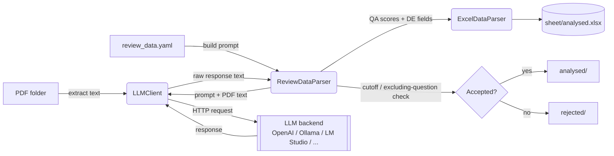

[](LICENSE)

# ReviewbyGPT

**Description:** ReviewbyGPT is a standalone Python CLI and library that automates the tedious parts of
a systematic literature review. For every PDF in a folder, it extracts the text, sends it to an LLM
together with a set of quality-assessment questions and data-extraction fields you define in a YAML
config, parses the structured answer back out, and records it in an Excel workbook — sorting each paper
into `analysed/` or `rejected/` based on a score cutoff you configure.

- **What it does** — extracts text from PDFs, sends it alongside a YAML-configured prompt to any
  OpenAI-compatible LLM (OpenAI, a local [Ollama](https://ollama.com) server,
  [LM Studio](https://lmstudio.ai), vLLM, text-generation-webui, ...), parses the quality-assessment
  scores and data-extraction fields out of the response, writes them to a formatted Excel report, and
  moves each PDF into `analysed/` or `rejected/` based on a cutoff score and excluding-question rules.
- **Who it is for** — researchers running a systematic literature review who need to triage, score, and
  extract data from a large batch of PDFs without reading every one by hand.
- **The problem it solves** — literature-review triage is usually done manually, or via one-off scripts
  tied to a single provider (this project's own first version drove ChatGPT through a browser).
  ReviewbyGPT replaces that with one consistent, config-driven pipeline: the review schema and scoring
  logic stay identical no matter which LLM backend you point it at.

**Screenshot:**

<!-- TODO: add a screenshot/GIF here — e.g. a terminal recording of a `reviewbygpt` CLI run, or a
     screenshot of the generated Excel report (QA + DE sheets). -->

---

## 1. Project status

ReviewbyGPT is at its **first public release (v0.1.0)**. The core pipeline — PDF extraction, LLM
analysis, response parsing, and Excel reporting — is complete, working end to end, and covered by an
automated test suite. It's a small, actively-maintained personal tool; the CLI flags and review-schema
format may still evolve based on feedback.

---

## 2. Technology stack

- **Language:** Python ≥ 3.9
- **Libraries:** [`PyPDF2`](https://pypi.org/project/PyPDF2/) (PDF text extraction),
  [`PyYAML`](https://pypi.org/project/PyYAML/) (review-schema config), `requests` (LLM API calls),
  [`openpyxl`](https://openpyxl.readthedocs.io/) (Excel report I/O)
- **Other tools:** pip/setuptools packaging (`pyproject.toml`), `pytest` (test suite), `argparse` (CLI)

ReviewbyGPT is a plain pip package with no external services required to install it — an LLM backend
(a hosted API, or a locally-run server like Ollama/LM Studio) is a *runtime* dependency you point it at
via configuration, not a build-time one. It is composed of two subsystems:

- **`reviewbygpt.lib`** — reusable building blocks: `LLMClient` (a generic OpenAI-chat-completions-
  compatible HTTP client), `ReviewDataParser` (builds prompts from `review_data.yaml` and parses the
  structured response), and `ExcelDataParser` (reads/writes the Excel report).
- **`reviewbygpt.scripts`** — the application layer: `main` (the `reviewbygpt` CLI entry point) and
  `PDFToExcelProcessor` (the pipeline orchestrator that ties the `lib` pieces together).

See [Architecture diagram](#7-architecture-diagram) for how these pieces fit together.

---

## 3. Dependencies

### Python (pip-installable, declared in `pyproject.toml`)

| Package | Used for |
|---|---|
| `PyPDF2` | extracting text from PDF files |
| `PyYAML` | parsing the `review_data.yaml` schema |
| `requests` | HTTP calls to the LLM's chat-completions API |
| `openpyxl` | reading/writing the Excel report |

**Test-only** — `pip install -e ".[test]"`:

| Package | Used for |
|---|---|
| `pytest` (`>=7.0`) | running the automated test suite (all HTTP calls are mocked — no live LLM needed) |

### System dependencies

None beyond Python itself — this is a pure-Python package. An LLM backend (OpenAI, a local Ollama
server, LM Studio, etc.) is required at *runtime* but is configured, not installed, as a dependency of
this package — see [Configuration](#6-configuration).

---

## 4. Installation

```bash
git clone https://github.com/pascd/ReviewbyGPT.git
cd ReviewbyGPT
pip install -e .

# Optional: install the test extra to run the automated test suite
pip install -e ".[test]"
```

Requires Python 3.9+. This installs a `reviewbygpt` console command as well as the `reviewbygpt` Python
package.

---

## 5. Usage

### Command line

```bash
reviewbygpt \
  --pdf-folder ./papers \
  --review-config ./config/review_data.yaml \
  --api-url http://localhost:11434/v1/chat/completions \
  --model gemma2:latest
```

Run `reviewbygpt --help` for the full list of flags (Excel sheet names, `--max-questions`,
`--max-content-length`, `--timeout`, `--log-level`, etc.). LLM backend settings can also be supplied via
a JSON file (`--llm-config`) or environment variables — see [Configuration](#6-configuration).

### Programmatic

```python
from reviewbygpt import PDFToExcelProcessor

processor = PDFToExcelProcessor(
    pdf_folder_path="./papers",
    review_config="./config/review_data.yaml",
    qa_sheet_name="qa_sheet",
    de_sheet_name="de_sheet",
    max_questions=10,
    api_url="http://localhost:11434/v1/chat/completions",
    model="gemma2:latest",
)
processor.run()
```

### Package layout

```
reviewbygpt/
├── lib/                  # LLMClient, ReviewDataParser, ExcelDataParser
└── scripts/
    ├── main.py           # CLI entry point (`reviewbygpt`)
    ├── pdf_to_excel.py   # PDFToExcelProcessor — pipeline orchestrator
    ├── ollama_diagnose.sh   # optional helper for self-hosting Ollama
    └── intall_cuda.sh       # optional GPU/CUDA setup helper for Ollama
config/                   # review_data.yaml schema + llm_api_config.json backend config
tests/                    # pytest suite (LLM calls mocked) + a manual live-integration example
```

### Output layout

Inside `--pdf-folder`, ReviewbyGPT creates:

- `sheet/analysed.xlsx` — the Excel workbook (QA sheet + DE sheet).
- `analysed/` — PDFs that passed the cutoff and excluding-question checks.
- `rejected/` — PDFs that didn't.
- `debug_logs/` — per-PDF prompt/extracted-text/response `.txt` files.
- `llm_responses.log` — a single running log of every response, in order.

---

## 6. Configuration

### Review schema (`review_data.yaml`)

Defines what the LLM is asked to evaluate/extract. See `config/review_data.yaml` for a full example
(a robotic-disassembly literature review); the schema is:

```yaml
quality_assessment_questions:
  - id: QE1
    question: "Is the methodology appropriate for the task?"
    scores: [0.0, 0.5, 1.0]   # possible scores the LLM can assign

cutoff_score: 6.5             # total QA score a paper needs to be "accepted"
excluding_questions: [QE1]    # any of these scoring 0 rejects the paper outright

data_extraction_fields:
  - key: TITLE
    description: "Title of the paper."
```

Copy and edit this file for your own review, then pass it via `--review-config`.

### LLM backend (`llm_api_config.json` and environment variables)

Configuration is resolved with this precedence (highest wins): **CLI flag** →
**environment variable** → **JSON config file** → built-in default.

`config/llm_api_config.json`:

```json
{
    "api_url": "http://localhost:11434/v1/chat/completions",
    "api_key": "",
    "model": "gemma2:latest",
    "temperature": 0.1,
    "max_tokens": 1024,
    "timeout": 600,
    "max_content_length": null
}
```

Or via environment variables (see `.env.example`): `LLM_API_URL`, `LLM_API_KEY`, `LLM_MODEL`. Prefer
environment variables (or a local, untracked config file) over CLI flags or committing a real value
into `llm_api_config.json` for anything that requires an API key.

**Using a hosted provider (e.g. OpenAI)** instead of a local server: set `LLM_API_URL` to
`https://api.openai.com/v1/chat/completions`, `LLM_MODEL` to a model you have access to, and
`LLM_API_KEY` to your API key.

---

## 7. Architecture diagram



`PDFToExcelProcessor` (`reviewbygpt/scripts/pdf_to_excel.py`) orchestrates this loop over every PDF in
the input folder.

---

## 8. Known issues

- **`PyPDF2` is deprecated upstream.** It still works, but the maintainers recommend migrating to
  [`pypdf`](https://pypi.org/project/pypdf/); not yet done here.
- **No automated test hits a live LLM.** The `pytest` suite mocks every HTTP call
  (`tests/test_llm_client.py`), so a real end-to-end run against an actual backend must be verified
  manually — see `tests/run_pdf_review.py` and [CONTRIBUTING.md](CONTRIBUTING.md).
- **Self-hosting via Ollama and hitting GPU/CUDA issues?** `reviewbygpt/scripts/ollama_diagnose.sh` and
  `reviewbygpt/scripts/intall_cuda.sh` are optional helper scripts for diagnosing and setting up
  GPU-accelerated Ollama inference. They're unrelated to ReviewbyGPT itself — useful only if you've
  chosen to self-host via Ollama.

---

## 9. License

ReviewbyGPT is licensed under the **MIT License** — see [LICENSE](LICENSE) for the full text.

Copyright © 2025 Pedro Dias.

---

## 10. Documentation and resources

- [CHANGELOG.md](CHANGELOG.md) — release history and notable changes
- [CITATION.cff](CITATION.cff) — citation metadata; use this if you use ReviewbyGPT in academic work
- `config/review_data.yaml` and `config/llm_api_config.json` — reference config templates
- [.env.example](.env.example) — environment-variable template for the LLM backend settings

---

## 11. Community standards and contribution

Contributions are welcome! Please review these before contributing:

- [Code of Conduct](CODE_OF_CONDUCT.md)
- [Contributing Guidelines](CONTRIBUTING.md)
- [Security Policy](SECURITY.md)

See [CONTRIBUTING.md](CONTRIBUTING.md) for how to set up a development environment, coding conventions,
and the pull-request process. By participating, you agree to abide by the
[Code of Conduct](CODE_OF_CONDUCT.md).

To report a security vulnerability, see [SECURITY.md](SECURITY.md) instead of opening a public issue.

---

## 12. Credits and acknowledgements

- Pedro Dias – Developer

---

## 13. Contacts

For support or inquiries, contact:

- Pedro Dias – pedro.afonso.cardoso.dias@gmail.com
